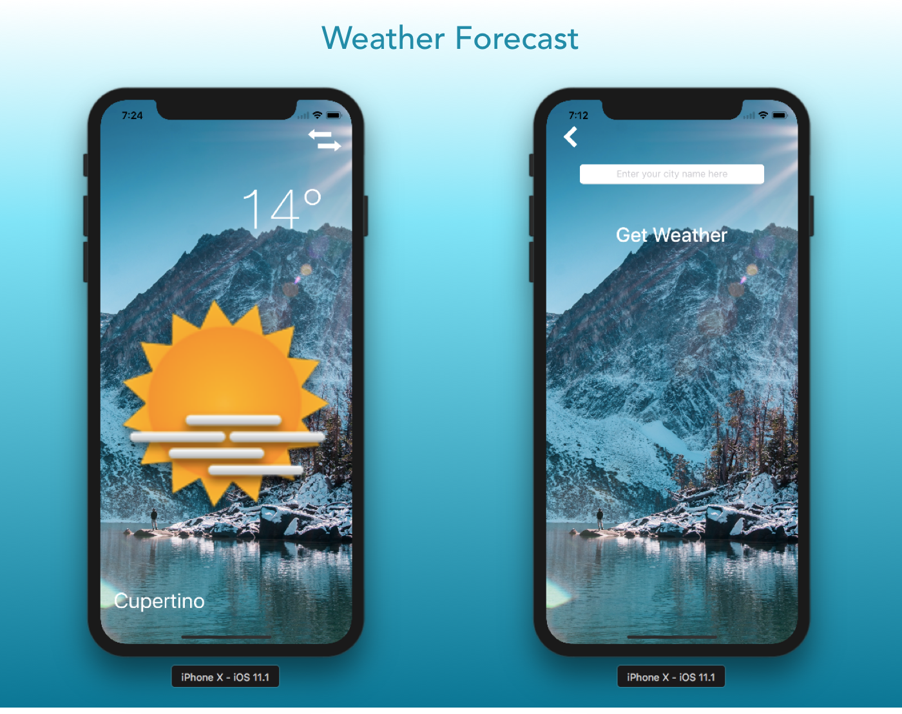

# Weather Forecast

Get the current weather forecast for your favourite places.

<h3 align="center">

</h3>

## Setup

### 1. OpenWeatherMap
* Create an account in [OpenWeatherMap](https://openweathermap.org)
* Generate a new `API Key`.
* Copy and paste the generated `API Key` in `API_KEY` property of `WeatherForecastVC` View Controller.

### 2. Google Places API
* To setup google places api for your project. Go to [Places SDK for iOS](https://developers.google.com/places/ios-sdk/start)
* Then copy and paste the `API KEY` in  `GMSPlacesClient.provideAPIKey("PASTE YOUR API KEY HERE")`  to your AppDelegate file.
* Then build and run the project.

## Compatibility

This project is written in Swift 4 and requires Xcode 9.1 to build and run.

## Author

* [Vinoth Vino](https://twitter.com/vinothvino42)
