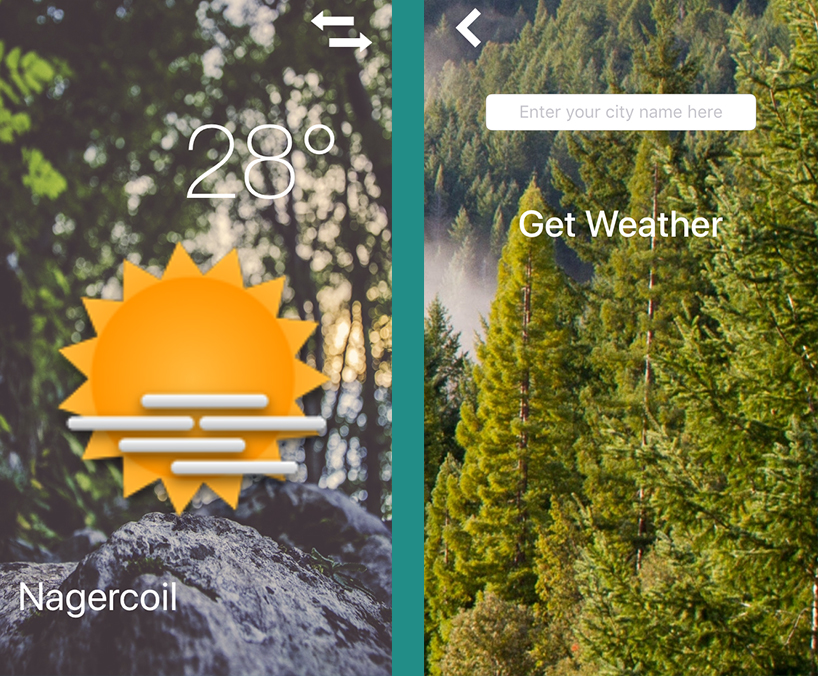

# Weather Forecast

Get the current weather forecast for your favourite places

<h3 align="center">

</h3>

## Compatibility

This project is written in Swift 4 and requires Xcode 9.1 to build and run.

## Author

* [Vinoth Vino](https://twitter.com/vinothvino42)
